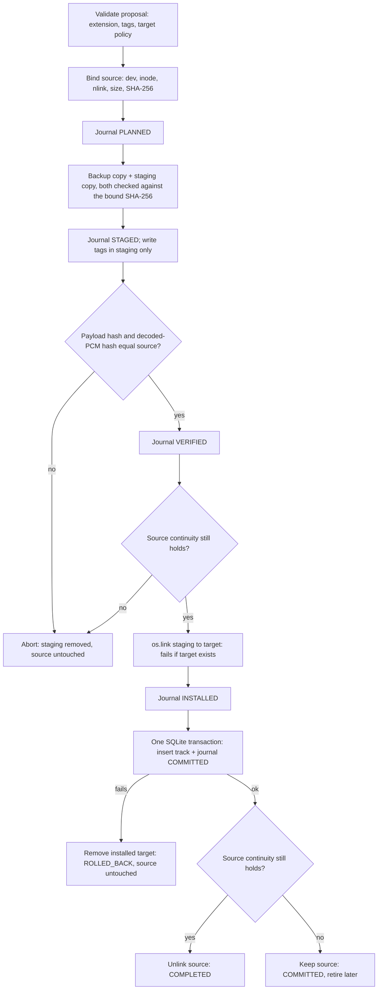

# InvariantAudio

> **A privacy-first, fail-closed toolkit for verifying music-library integrity and applying journaled, hash-verified metadata changes.**

[](LICENSE)
[](pyproject.toml)
[](CHANGELOG.md)

**Status: v0.1.0-alpha (`0.1.0a1`).** This is an early alpha for a Linux/POSIX system. Read [What is and is not implemented](#2-what-is-and-is-not-implemented-in-v010-alpha) before trusting it with a library you cannot restore from your own backups.

---

## 1. What problem it addresses
Tagging tools can silently damage audio: re-encoding, clipping, rewriting more than the metadata, or overwriting an unrelated file that happens to be at the destination path. InvariantAudio's mutation engine is built around a narrow, checkable contract:

> Change tags and relocate a file **only if** the compressed audio payload and the decoded PCM of the result are hash-identical to the source, **never** overwrite an existing destination, and **never** remove the original before the database commit that records the new file.

---

## 2. What is and is not implemented in v0.1.0-alpha

### Implemented (and covered by the test suite)
| Capability | Where | How you use it |
|---|---|---|
| Stream-health classification via a full `ffmpeg` decode (`TRUSTED`, `DAMAGED_BUT_PLAYABLE`, `INTEGRITY_EXCEPTION`, `UNUSABLE`) | `integrity` | CLI `verify` |
| Read-only listing of audio files | `discovery` | CLI `scan` |
| SQLite catalog (schema v7: `tracks`, `production_transactions`) | `recovery` | CLI `init-db` |
| Path-level library audit (indexed paths vs files on disk) | `reporting` | CLI `audit` |
| Journaled tag-write + relocate engine for `.mp3` and `.m4a`: no overwrite, same-filesystem staging, payload + PCM verification, source-continuity revalidation, backup, post-commit source retirement | `transactions` | Python API (`TransactionEngine.apply_batch`) |
| Deterministic recovery of interrupted transactions | `recovery` | CLI `recover`, `TransactionEngine.recover()` |
| Quarantine of a file with backup and no overwrite (not journaled) | `quarantine` | Python API |
| Strict configuration parsing | `config` | all CLI commands except `verify` |
| Scoring formula, duration/margin gates, version-keyword veto, manifest hashing, synthetic-ID rejection | `evidence`, `duplicates`, `approvals` | Python API; **building blocks only, not wired into any workflow** |

### Not implemented (planned; see [ROADMAP.md](ROADMAP.md))
- Any network access. The package contains **no** MusicBrainz or AcoustID client, no rate limiter, and no query sanitizer used for external requests. (A test asserts the package imports no network modules.)
- Candidate identification pipeline (fingerprint → lookup → score → decide), automatic or human approval workflows, review packets, and remediation orchestration.
- CLI subcommands for applying batches or quarantining files.
- Deduplication and version resolution.
- Windows/macOS support (locking is POSIX `flock`; only Linux is tested).

`fpcalc` (Chromaprint) is wrapped by `discovery.compute_acoustic_fingerprint` but no command calls it, and it is not needed to run the tests.

---

## 3. The mutation engine, precisely



Full details, including what is *not* guaranteed: [docs/transaction-model.md](docs/transaction-model.md), [docs/safety-model.md](docs/safety-model.md), [docs/recovery.md](docs/recovery.md).

Key properties:
- **No overwrite.** The target is installed with a hard link, which fails if anything exists there. Existing different, identical, aliased, symlinked, or Unicode/case-equivalent destinations are refused with distinct error codes.
- **Database failure cannot cost the original.** The source file is removed only after the SQLite commit; if the commit fails the installed target is removed and the source is untouched.
- **Same-filesystem staging is enforced** before anything is created.
- **Not ACID across file system and SQLite.** SQLite is atomic for the track row plus journal state; the file operations are individually atomic and ordered, and a journal plus recovery makes the whole sequence crash-recoverable. See the transaction model for the exact claim.

---

## 4. Install

Requirements: Linux, Python 3.10+, and `ffmpeg` on `PATH`. CI runs on Ubuntu 24.04 with the distribution's `ffmpeg`; other distributions and versions are untested.

```bash
git clone https://github.com/thathugesamoan-byte/invariantaudio.git
cd invariantaudio
python -m venv .venv && . .venv/bin/activate
pip install -e ".[dev]"
python -m pytest
```

## 5. Quick start

`--config` is a global option and goes **before** the subcommand.

```bash
cp config.example.yaml config.yaml        # then edit the paths; config.yaml is git-ignored
invariant-audio --config config.yaml init-db
invariant-audio --config config.yaml scan
invariant-audio --config config.yaml audit
invariant-audio verify /path/to/song.mp3  # needs no config
invariant-audio --config config.yaml recover   # only after an interrupted run; modifies files
```

`scan`, `audit` and `verify` are read-only. `init-db` creates the database file. `recover` modifies files and takes the mutation lock. There is no CLI command that applies a batch in v0.1.0-alpha; see [examples/basic_usage.py](examples/basic_usage.py) for the Python API.

---

## 6. Status model
1. **`TRUSTED`**: full decode produced no warnings.
2. **`DAMAGED_BUT_PLAYABLE`**: decode succeeded with warnings. The engine records this status and does not alter the audio stream.
3. **`INTEGRITY_EXCEPTION`**: decode warnings that indicate dropped or invalid data.
4. **`UNUSABLE`**: decode failed; the engine refuses such files (use quarantine).

These classes come from string-matching `ffmpeg` warnings (see [docs/damaged-media.md](docs/damaged-media.md)); they are a triage aid, not a forensic determination.

---

## 7. Historical deployment (not reproduced by this repository)
An earlier, private implementation of this approach was used on a personal library of 2,003 tracks. Those figures are the operator's own historical records and **cannot be reproduced from this repository**, which ships synthetic fixtures only and a smaller feature set (no identification pipeline, no approval workflow). See [docs/case-study-reference-deployment.md](docs/case-study-reference-deployment.md) for what is and is not claimed.

---

## 8. Documentation
[Architecture](docs/architecture.md) · [Safety model](docs/safety-model.md) · [Transaction model](docs/transaction-model.md) · [Recovery](docs/recovery.md) · [Privacy model](docs/privacy-model.md) · [Identification (partial)](docs/identification.md) · [Approval model (planned)](docs/approval-model.md) · [Damaged media](docs/damaged-media.md) · [Configuration](docs/configuration.md) · [CLI](docs/cli.md) · [Limitations](docs/limitations.md) · [Security policy](SECURITY.md) · [Privacy policy](PRIVACY.md) · [Roadmap](ROADMAP.md) · [Changelog](CHANGELOG.md) · [Third-party notices](THIRD_PARTY_NOTICES.md)

## 9. License
GNU General Public License v3.0 or later (`GPL-3.0-or-later`). See [LICENSE](LICENSE) and [THIRD_PARTY_NOTICES.md](THIRD_PARTY_NOTICES.md).
