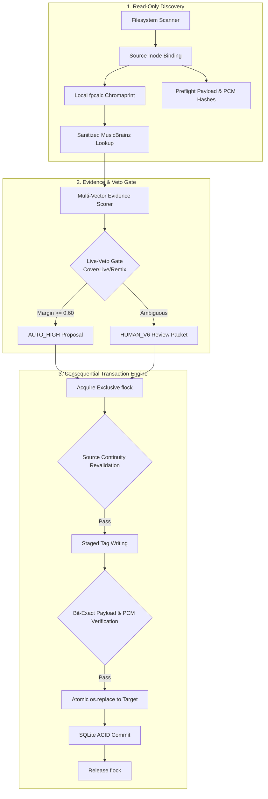

# InvariantAudio

> **A privacy-first, fail-closed music library identification, integrity, and remediation framework.**

[](CHANGELOG.md)
[](LICENSE)
[](pyproject.toml)
[](docs/safety-model.md)

---

## 1. Why InvariantAudio Exists
Digital music collections accumulated over decades frequently suffer from structural decay: missing or garbled tags, tracks scattered across fragmented folders, duplicate files, version ambiguity (live vs studio cuts), and latent audio bitstream damage.

Standard commercial taggers and automated cloud tools present severe data integrity risks:
- **Destructive Tagging**: Rewriting metadata without verifying that audio streams remained untouched.
- **Silent Audio Transcoding**: Inadvertently re-encoding MP3/AAC streams or clipping frames during "repair".
- **Time-Of-Check to Time-Of-Use (TOCTOU) Races**: Modifying files in place without kernel locks or inode binding.
- **Privacy Leakage**: Transmitting raw audio samples or listening telemetry to third-party cloud servers.

**InvariantAudio** was engineered to solve these problems through a **forensic-grade, transactional, local-first architecture**.

---

## 2. Core Architectural Principles
1. **Bit-Exact Audio Preservation**: Metadata updates alter container headers only. InvariantAudio **verifies bit-exact preservation of compressed audio payloads and decoded PCM during supported metadata-only operations**. If hashes do not match, the transaction fails closed and rolls back.
2. **Fail-Closed Transactional Safety**: Any error, hash mismatch, or unexpected condition halts execution and rolls back immediately.
3. **Parent-Only Mutation Invariant**: A single process acquires the exclusive advisory lock (`flock`) and performs all mutations directly, eliminating subprocess lock-inheritance races.
4. **Local-First Privacy & Controlled Egress**: 100% of fingerprinting and stream decoding executes locally. No user accounts, no telemetry, and zero raw audio uploads.
5. **Dual-Approval Governance**: Separates mathematically unambiguous matches (`AUTO_HIGH`) from complex cases requiring cryptographic human review manifests (`HUMAN_V6`).

---

## 3. System Architecture



---

## 4. Safety & Invariant Guarantees
- **Source Continuity Tuple**: Verifies `(st_dev, st_ino, st_nlink, size, sha256)` across the full mutation lifecycle.
- **Payload & PCM Invariant**:
  $$\text{SHA256}(\text{Payload}_{\text{before}}) == \text{SHA256}(\text{Payload}_{\text{after}})$$
  $$\text{SHA256}(\text{PCM}_{\text{before}}) == \text{SHA256}(\text{PCM}_{\text{after}})$$
- **Small Batches**: Production mutations are partitioned into batches of $\le 10$ tracks to minimize lock contention and enable instant rollback.

---

## 5. Installation & External Requirements

### System Prerequisites
- Linux OS (Ubuntu 20.04+, Debian 11+, Arch, Fedora)
- Python 3.10+
- `ffmpeg` and `ffprobe` (v4.4+) — external standalone CLI requirement
- `fpcalc` (Chromaprint v1.5+) — external standalone CLI requirement

### Install via pip
```bash
git clone https://github.com/thathugesamoan-byte/invariantaudio.git
cd invariantaudio
pip install -e .
```

---

## 6. Quick Start (Read-Only Default)

By default, all discovery and audit operations run in **strict read-only mode**:

```bash
# 1. Copy example configuration
cp config.example.yaml config.yaml

# 2. Initialize local SQLite catalog schema v6
invariant-audio init-db --config config.yaml

# 3. Scan media library (Read-Only)
invariant-audio scan --config config.yaml

# 4. Verify stream integrity on an individual file
invariant-audio verify /path/to/song.mp3

# 5. Run full library inventory balance audit
invariant-audio audit --config config.yaml
```

---

## 7. Status Model
Every indexed track is assigned a verified status:
1. **`TRUSTED`**: Pristine recordings with zero decode warnings and verified 100% loss-free bitstream preservation.
2. **`DAMAGED_BUT_PLAYABLE`**: Structurally complete tracks with minor bit-reservoir/sync warnings that decode to complete, audible PCM streams. Native bitstreams are 100% preserved without transcoding.
3. **`INTEGRITY_EXCEPTION`**: Audio with pre-existing dropped frames deferred for future pristine replacement without destructive clipping.

---

## 8. Real-World Case Study (Typhon Deployment)
This framework was hardened and validated across a real-world library of **2,003 digital audio tracks**:
- **1,843 tracks** verified as `TRUSTED` (92.01%).
- **159 tracks** verified as `DAMAGED_BUT_PLAYABLE` (7.94%).
- **1 track** deferred under `INTEGRITY_EXCEPTION` (0.05%).
- **0 unindexed loose files** remaining on disk.
- **100.0% payload and PCM sample preservation** across 1,952 production transactions.
- **0 active synthetic identifier violations**.

See [`docs/case-study-typhon.md`](docs/case-study-typhon.md) for full forensic details.

---

## 9. Documentation Index
- [Architecture & Pipelines](docs/architecture.md)
- [Safety Model & Invariants](docs/safety-model.md)
- [Privacy & Egress Architecture](docs/privacy-model.md)
- [Identification & Candidate Scoring](docs/identification.md)
- [Approval Governance (AUTO vs HUMAN)](docs/approval-model.md)
- [Transaction Engine & Locking](docs/transaction-model.md)
- [Crash Recovery & Rollback](docs/recovery.md)
- [Damaged-Media Forensics](docs/damaged-media.md)
- [Configuration Reference](docs/configuration.md)
- [CLI Reference](docs/cli.md)
- [Known Limitations](docs/limitations.md)

---

## 10. License & Legal
InvariantAudio is licensed under the **GNU General Public License v3.0 or later (GPL-3.0-or-later)**. See [`LICENSE`](LICENSE) and [`THIRD_PARTY_NOTICES.md`](THIRD_PARTY_NOTICES.md).
